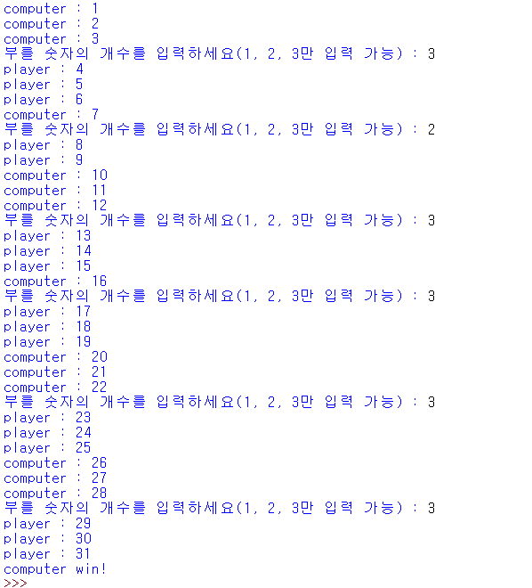
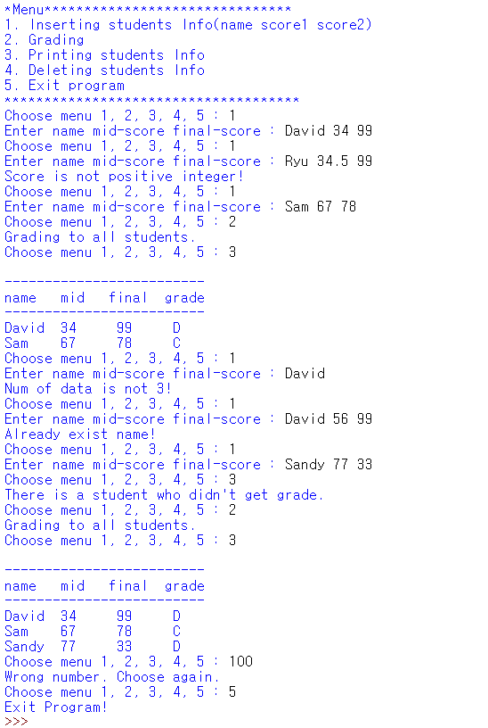
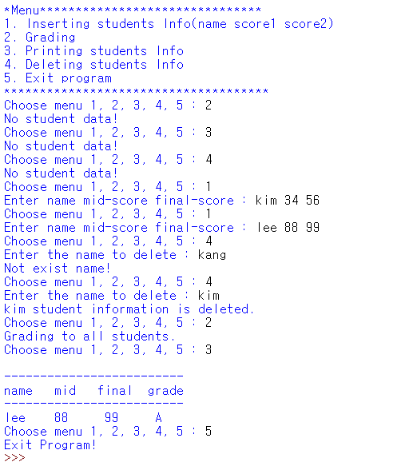

# ParkYejin

# 1주차 과제

## 6월 28일 화요일

1.  제로초 html/css 34강(8-3)까지 수강

    

1.  깃허브 페이지 구현하고 커밋

    

    - 네브 바의 Sign in, Sign up은 클릭 가능
    - 'Search GitHub'이라고 써있는 곳은 입력창
    - 메인 페이지 오른쪽 영역에 내용 입력하면 배경색 변하게
    - 'Sign up for gitHub'이라 써있는 영역은 버튼

## 6월 30일 목요일

1. 아르샤 팀 클론코딩

## 7월 3일 토요일

1. 파이썬 코딩도장 20강까지 수강

   

   - 퀴즈 / 심사문제 성적표 이미지 파일 커밋

2. 부트스트랩 과제

   - 노션에 첨부한 동영상을 참고하여 전부 클론 코딩
   - 스크롤을 완전히 내린 곳까지 클론코딩
   - 반응형으로 구현하되 내부에 있는 글과 사진들은 똑같을 필요 없음

     
   

# 2주차 과제

## 7월 5일 화요일

1. Javascript를 이용한 스톱워치 만들기

- 총 4가지 기능 구현(스톱워치, 기록 추가, 선택 삭제, 전체 삭제)

  

## 7월 7일 목요일

1. 파이썬 코딩도장 수강

- 34, 35, 36, 38, 44, 45강까지 수강
- 퀴즈 / 심사문제 성적표 이미지 파일 커밋

  

2. python 개인 과제

- 노션에 있는 2문제 풀기

  **문제 1**
  

  **문제 2**
  
  
