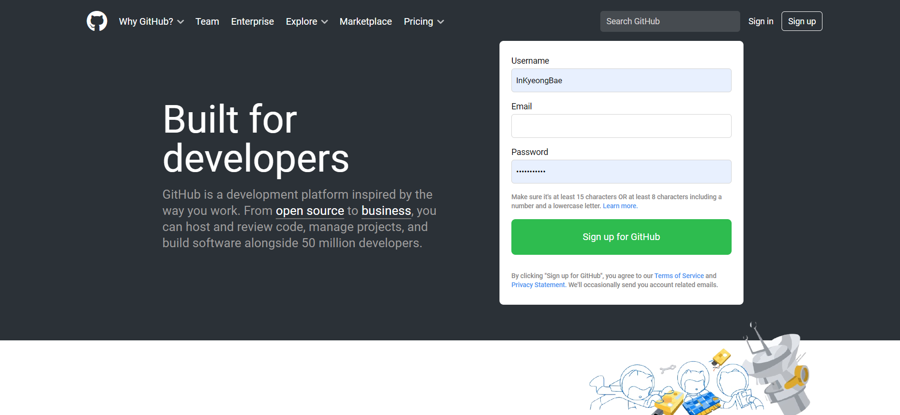

# ParkYejin

## 6월 28일 화요일 과제

1.  제로초 html/css 34강(8-3)까지 수강

    

1.  깃허브 페이지 구현하고 커밋

    

    - 네브 바의 Sign in, Sign up은 클릭 가능
    - 'Search GitHub'이라고 써있는 곳은 입력창
    - 메인 페이지 오른쪽 영역에 내용 입력하면 배경색 변하게
    - 'Sign up for gitHub'이라 써있는 영역은 버튼
