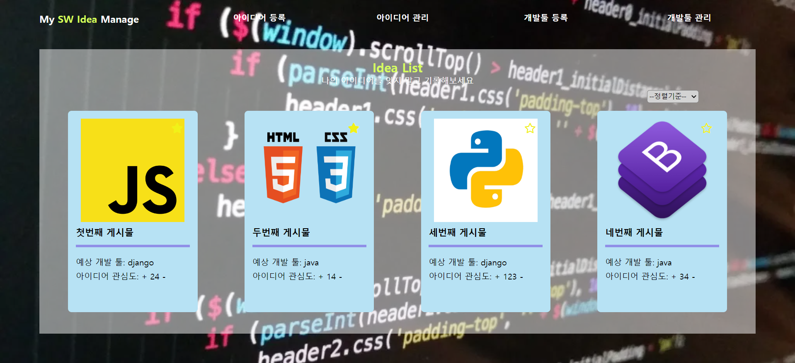
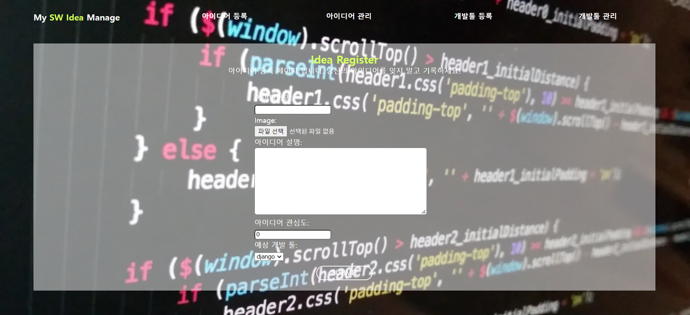
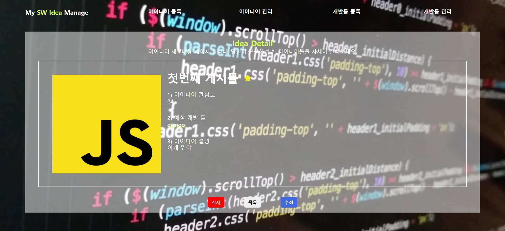
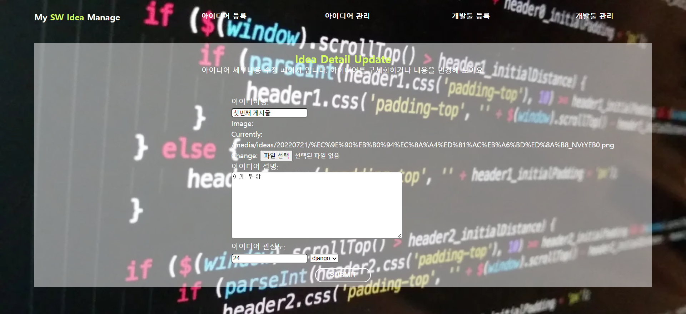
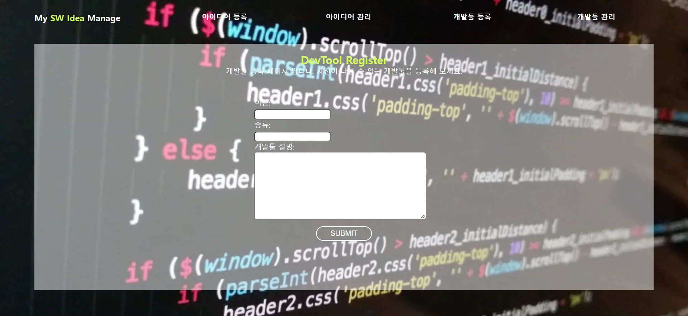
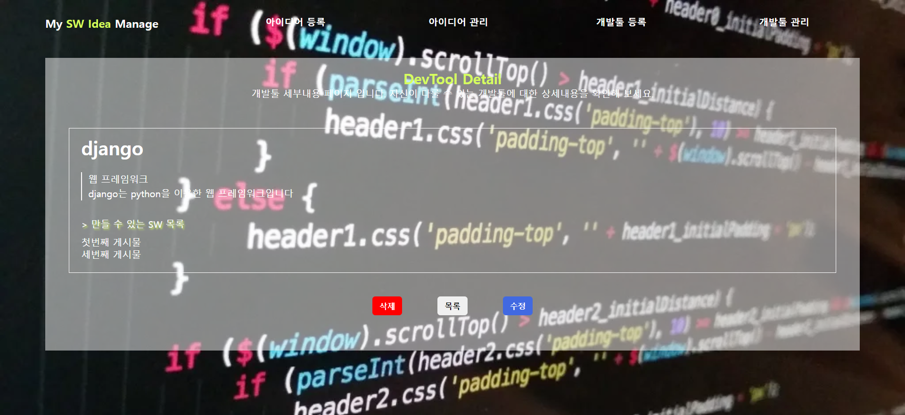
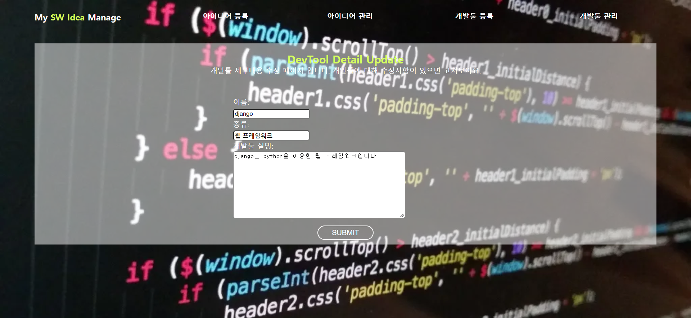

구현한 기능: 1, 2, 3, 4, 5, 6, 7, 8, 9, 10, 11, 12, 13, 14, 15 🥰  
구현하지 못한 기능: x

```
!!! 참고해주세요 !!!
<찜하기 기능>과 <관심도 기능> idea.id가 겹쳐
<관심도 기능> 버튼을 클릭하실 땐 찜하기 버튼 부분을 지워주셔야
정상 작동하게 됩니다 ...
```

- IdeaHome
  
- IdeaCreate
  
- IdeaDetail
  
- IdeaUpdate
  

- ToolHome
  
- ToolCreate
  
- ToolDetail
  
- ToolUpdate
  
